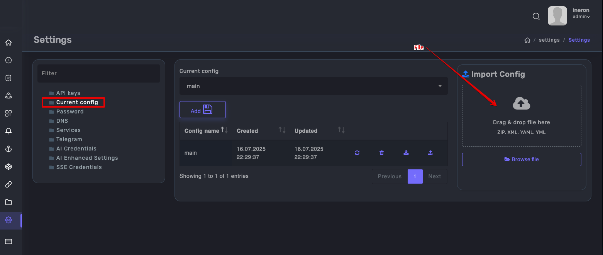
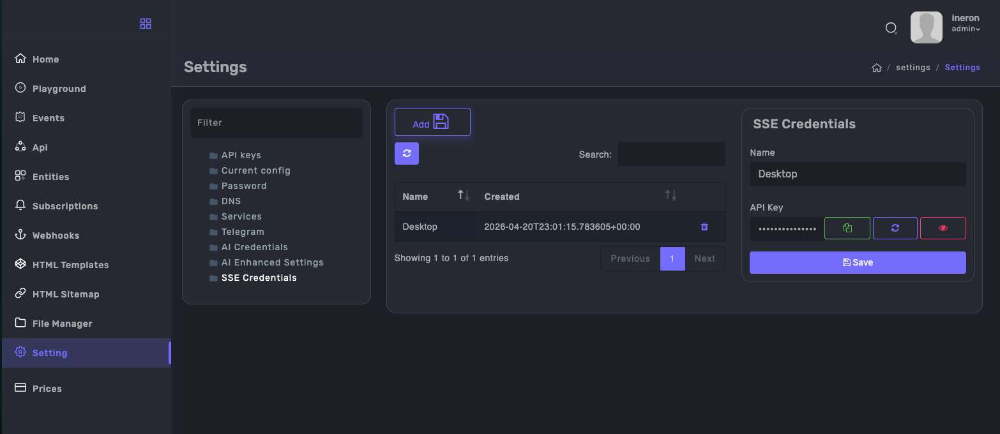
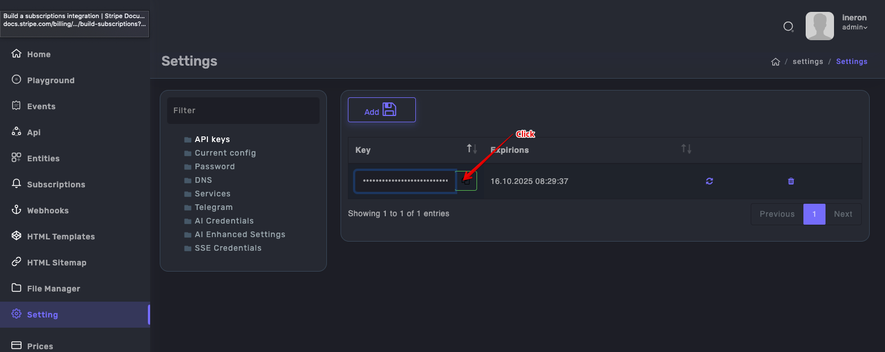
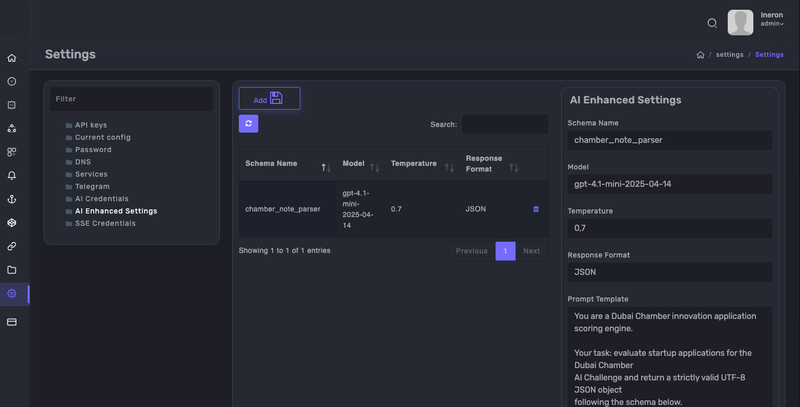
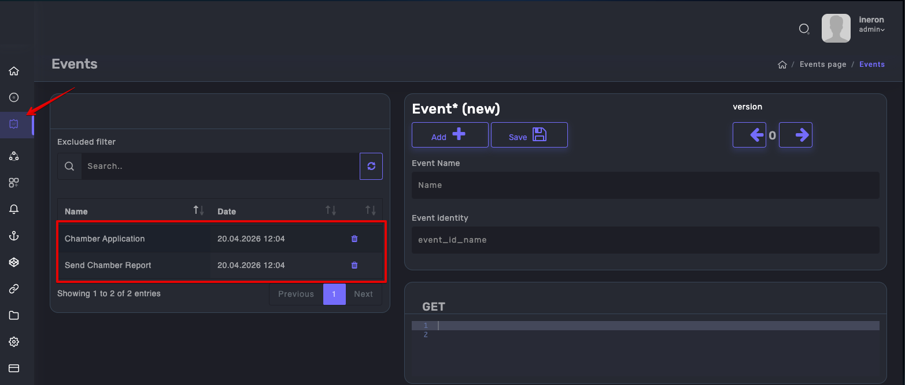
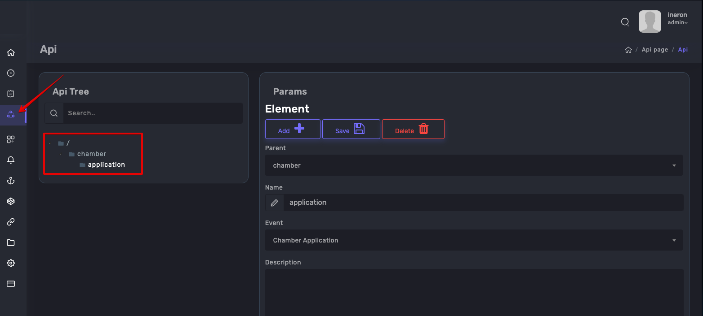

# LedgyxAIQueryExample — Setup Guide

A step-by-step guide to setting up the Dubai Chamber AI scoring pipeline in Ledgyx.

This example shows how to:
- Receive a startup application via HTTP POST
- Score it automatically using OpenAI via the `call()` function
- Push the result in real time via SSE to Obsidian or a browser

---

## Prerequisites

- [Ledgyx](https://ledgyx.com) account
- OpenAI API key
- [Node.js SDK](https://www.npmjs.com/package/ledgyx-api) (optional)

---

## Step 1 — Import the configuration file

Go to **Settings → Current Config** and drag & drop `chamber_scoring.yaml` into the **Import Config** area on the right side.



This will automatically create:
- AI Enhanced Settings (`chamber_note_parser`)
- Both event handlers
- The API endpoint

---

## Step 2 — Add your OpenAI API key

Go to **Settings → AI Credentials** and create a new credential with the following parameters:

| Field | Value |
|-------|-------|
| Provider Name | OpenAI |
| Provider | OpenAI |
| Model | gpt-4.1-mini-2025-04-14 |
| Base URL | https://api.openai.com/v1 |
| Max Tokens | 8000 |
| Temperature | 0.2 |
| Response Format | JSON |
| API Key | *your OpenAI API key* |

---

## Step 3 — Add your SSE credential

Go to **Settings → SSE Credentials** and create a new credential named **Desktop**.
Copy the generated API key — you will need it to connect your SSE client.



---

## Step 4 — Copy your Ledgyx API key

Go to **Settings → API Keys** and click the copy button next to your key.
This key is used to authenticate requests to your endpoint.



---

## Step 5 — Verify AI Enhanced Settings

Go to **Settings → AI Enhanced Settings** and confirm that `chamber_note_parser` was imported correctly with the right model and prompt template.



---

## Step 6 — Verify Events

Go to **Events** and confirm that both events were created:
- **Chamber Application** — receives the HTTP POST and triggers AI scoring
- **Send Chamber Report** — pushes the scored result via SSE



---

## Step 7 — Verify API Endpoint

Go to **API** and confirm that the `chamber/application` endpoint exists with **Chamber Application** assigned as the event handler.



---

## Step 8 — Submit a test application

Replace `YOUR_API_KEY` with your actual values and run:

```bash
curl -X POST https://app.ledgyx.com/rest/v2/{YOUR_API_KEY}/chamber/application \
  -H "Content-Type: application/json" \
  -d '{
    "company": "NovaMed AI",
    "sector": "HealthTech",
    "stage": "MVP",
    "region": "UAE",
    "description": "AI-powered triage system for hospital emergency departments. Reduces patient wait times by 40% using real-time symptom analysis and priority scoring.",
    "desc_compliance": "Deployed on AWS UAE region. All data remains within UAE borders.",
    "timeline_to_market": "6 months"
  }'
```

---

## Step 9 — View the result via SSE

Connect to the SSE stream to see the scored result appear in real time.

### Option A — Browser test page

Open [https://ineron.ae/sse_test.html](https://ineron.ae/sse_test.html) and enter your SSE credentials to connect and view the live stream.

### Option B — Obsidian plugin

Install the [SSE Notes Receiver](https://github.com/ineron/sse-notes-receiver) plugin for Obsidian.
The scored result will appear automatically as a new note with folder path and tags already assigned — exactly as defined in the `Send Chamber Report` event.

---

## Expected Response

After submitting the test application, the SSE stream will deliver:

```
Title Score this startup application for Dubai Chamber:
 - Company: NovaMed AI
 - Sector: HealthTech
 - Stage: MVP
 - Region: UAE
 - Description: AI-powered triage system for hospital emergency departments...
 - DESC compliance: Deployed on AWS UAE region. All data remains within UAE borders.

# Metrics
---
 - Total Score: 82
 - Recommendation: shortlist
 - Relevance Score: 26
 - Compliance Score: 21
 - Feasibility Score: 20
 - Completeness Score: 15

tag MVP
tag HealthTech
Timeline: 6 months
```

---

## How It Works

```
POST /chamber/application
        ↓
  Chamber Application event
        ↓
  call(AI) → OpenAI scores the application
        ↓
  Webhook response → next event triggered
        ↓
  Send Chamber Report event
        ↓
  SSE push → Obsidian note or browser
```

No blocks. No drag and drop. Just SQL.

---

## Links

- 📦 Node.js SDK: [npmjs.com/package/ledgyx-api](https://www.npmjs.com/package/ledgyx-api)
- 🌐 SSE Test Page: [ineron.ae/sse_test.html](https://ineron.ae/sse_test.html)
- 🔌 Obsidian Plugin: [github.com/ineron/sse-notes-receiver](https://github.com/ineron/sse-notes-receiver)
- 🔗 Platform: [ledgyx.com](https://ledgyx.com)
